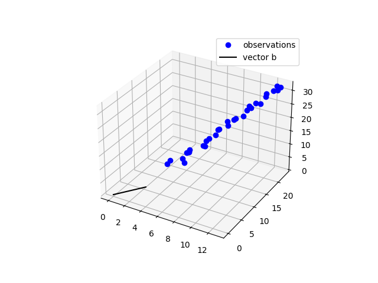
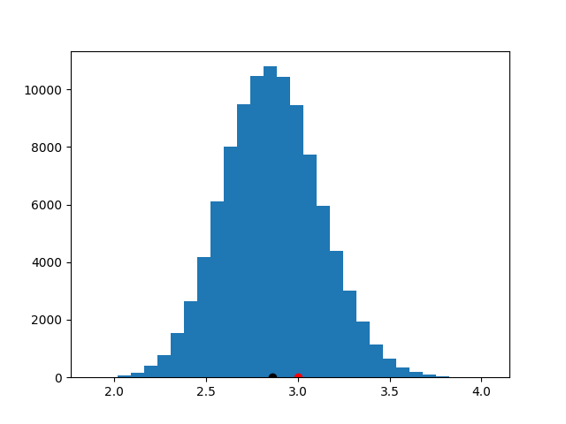

# ProbabilisticFluxVariationGradient.jl

## Installation

This package is implemented in the Julia language. 

A current release may downloaded [here](https://julialang.org/). 

1 - Add the registry [AINJuliaRegistry](https://github.com/HITS-AIN/AINJuliaRegistry).

2 - Switch into "package mode" with ```]``` and add the package with
```
add ProbabilisticFluxVariationGradient
```
3 - Go back to the REPL (press backspace) and execute:
```
using ProbabilisticFluxVariationGradient
```

## Updating the package

Switch into "package mode" with ```]``` and add type ```registry update AINJuliaRegistry```. 

This will make Julia update all packages associated with ```AINJuliaRegistry``` registry. 

Alternatively, you enter package mode and type ```up```. This will update all packages in Julia, including this one.

# Using the package

## Available functions

Currently, `ProbabilisticFluxVariationGradient` provides three functions: `mockline`, `bpca` and `noisyintersectionvi`

For a basic description of what these functions do, you can enquire with
```?bpca``` or ```?noisyintersectionvi```.


## Example: identify line and locate intersection point

We present an example of what the package does while abstracting from the specifics of the physical application. 

At its core, the implemented model knows nothing about physics.

Its first job is to identify the line on which data items lie (using function `bpca`).

Its second job is to locate the intersection point between the identified line and a line specified by a user-supplied vector (using function `noisyintersectionvi`).

Function `mockline` provides us with some synthetic  (not physically plausible!) data with which we demonstrate how to use the package.
Here, we create some data using the line equation 𝐚 ⋅ t + 𝐛. 
Let us create the dataset using:

```
# Load this package
using ProbabilisticFluxVariationGradient

# Load some extra packages required by the example (need to be independently installed)
using PyPlot, Distributions

a = [1.0; 2.0; 3.0] 
b = [3.0; 3.0; 3.0]
t_range = LinRange(2.0, 10.0, 30) # t ∈ t_range
σ = 0.35 # standard deviation of mean-zero Gaussian noise to be added on data items

observations, errors = mockline(a=a, b=b, t_range=t_range, σ=σ)  # a plot will appear now
```



We now use Bayesian probabilistic principal component analysis (BPCA) to obtain the posterior parameter distribution of the line 𝐚 ⋅ t + 𝐛 passing through the observed data. To that end, we use function ```bpca``` which takes as mandatory arguments the observations and their error measurements. Both arguments need to be organised as D×N matrices where D is the dimensionality of the data (i.e. the number of filters in the physical applications) and N is the number of observations. In this example, D=3 and N=30. We use ```bpca``` as follows:


```
# run for one iteration only for warmup (i.e. when first run Julia pre-compiles code)
posterior = bpca(observations, errors, maxiter=1)

# run for more iterations (if maxiter is not specified, the default value is 1000)
posterior = bpca(observations, errors, maxiter=500)
```

The returned ```posterior``` is of type ```MvNormal``` which represents the joint normal distribution of the parameters 𝐚 and 𝐛.
As it is of type ```MvNormal```, one call on it the functions described at [Distributions.jl](https://juliastats.org/Distributions.jl/latest/multivariate/#Common-Interface-1). For example, one can draw a sample or calculate the mean:

```
rand(posterior)
# the first D (i.e. 1 to 3) elements correspond to parameter 𝐚 and the next D elements (4 to 6) correspond to 𝐛
6-element Array{Float64,1}:
 -0.038242196129264064
 -0.033830491753945195
 -0.027160785291227445
  0.3721138056420776
  0.46481536350207064
  0.5867996738975586
  
 mean(posterior) # output omitted
 
 # other statistics, output omitted
 cov(posterior)
```

We will now work out the intersection of a candidate vector, here `b`, with the density of lines represented by ```posterior```. To do this, we use the function ```noisyintersectionvi``` which takes two mandatory arguments as shown below:

```
randx = noisyintersectionvi(posterior = posterior, g = b)

# it is worth trying also: 
# randx = noisyintersectionvi(posterior = posterior, g = b/10.0)
# or
# randx = noisyintersectionvi(posterior = posterior, g = b*10.0)
# Both should return the same result as the function call above.

```

The function ```noisyintersectionvi``` returns a function `randx`. When called, this function returns a single sample from the distribution of the intersection point. Note that we return no explicit distribution for the intersection point, but rather a function that draws samples from it.

We may plot histograms of how the coordinates of the intersection point are distributed. Here for example, we plot the histogram for the first coordinate:
```
figure()

# plot histogram of first coordinate
plt.hist([randx()[1] for i=1:10_000], 30)

# put also the mean value of the 1st coordinate on histogram as black dot
plot(mean([randx()[1] for i=1:10_000]), 0.0, "ko")

# put also the true value of the 1st coordinate on histogram as red dot
plot(b[1], 0.0, "ro")
```


Note that, for this particular example, if you plot the histograms for the other two coordinates, you will get plots identical to the ones above. This may appear strange, but it is simply because all three coordinates are dependent on the random variable that scales vector 𝐛 so that it points to the sought intersection point. We do not elaborate this issue any further here.

It is worth re-running this entire example again to see how the histogram fluctuates between runs when new data are randomly generated each time.
